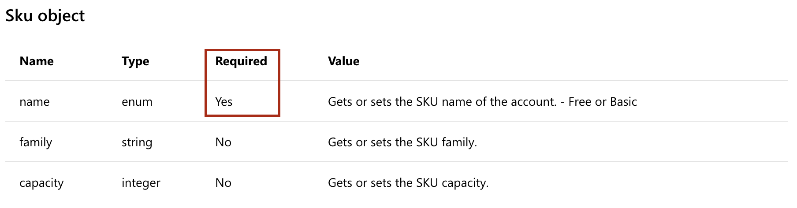
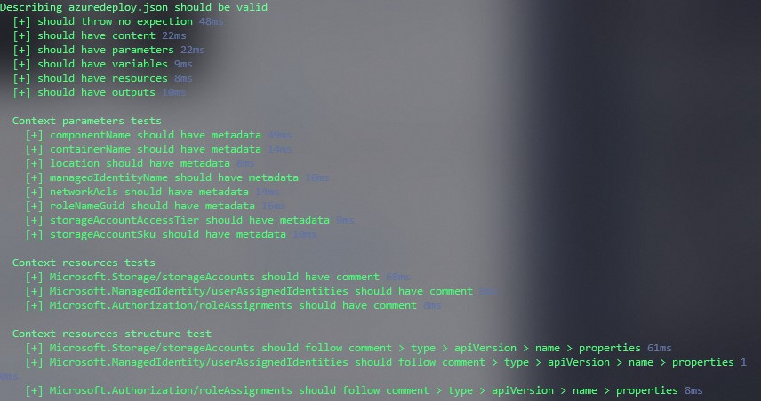
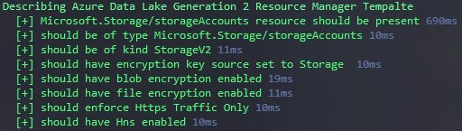

Treat Infrastructure as Code development like a software engineering project.
In this article we are building on top of the post "Test Infrastructure as Code".
We are looking into and digging a little deeper on how to unit test Infrastructure as Code.

# Draft 15.08.19

Generally Infrastructure as Code (IaC) can be distinguished between two [approaches](http://markwarneke.me/Cloud-Automation-101/Article/01_Cloud_Automation_Theory.html#Approach).

### Declarative

When following the best practices for Infrastructure as Code by using a [**declarative approach**](http://markwarneke.me/Cloud-Automation-101/Article/01_Cloud_Automation_Theory.html#approach) to provision resources the _unit_ is the configuration file, or Azure Resource Manager (ARM) template, which is a JSON file.

### Imperative

The imperative approach on the other hand like [@pascalnaber](https://twitter.com/pascalnaber) describes it in his wonderful blog post [stop using ARM templates! Use the Azure CLI instead](https://www.google.com/search?q=stop+using+azure+resource+manager+templates&oq=stop+using+azure+resource+manager+templates&aqs=chrome..69i57j33l3.5812j1j7&sourceid=chrome&ie=UTF-8) requires that you actual test the function or script you are using to provision resoruces.

## Unit Tests

> The foundation of your test suite will be made up of unit tests. Your unit tests make sure that a certain unit (your subject under test) of your codebase works as intended. Unit tests have the narrowest scope of all the tests in your test suite. The number of unit tests in your test suite will largely outnumber any other type of test. - [The Practical Test Pyramid](https://martinfowler.com/articles/practical-test-pyramid.html#UnitTests)

Having an Azure Resource Manager Template (ARM Template) as the subject under test we are looking for a way to test a JSON configuration file.
I have not yet heard of a Unit Testing framework for configuration files like YAML or JSON.
The only tool I am aware of are [linter](<https://en.wikipedia.org/wiki/Lint_(software)>) for these file types.
The approach of a linter gives us a good starting point to dig deeper into static analysis of code.

As the configuration file usually describes the desired state of the system to be deployed.
The specified system consists generally of one ore more Azure resources that needs to be provisioned.
Each resource in an Azure Resource Manager template adheres to a specific [schema](https://github.com/Azure/azure-resource-manager-schemas).
The schema describes the resources properties that needs to be passed to be able to be deployed.
It also indicates mandatory and optional values.
The human readable form of the schema can be found in the [Azure Template Refernce](https://docs.microsoft.com/en-us/azure/templates/).

Taking the automation account as an example the Azure Resource Manager Template resource implementation looks like this.

```json
{
  "name": "string",
  "type": "Microsoft.Automation/automationAccounts",
  "apiVersion": "2015-10-31",
  "properties": {
    "sku": {
      "name": "string",
      "family": "string",
      "capacity": "integer"
    }
  },
  "location": "string",
  "tags": {}
}
```

Inside the `properties` property only the `SKU` property needs to be configured.
The SKU object only expects to have a `name` as a required parameter.


A quick way to test could therefore be validating the schema and ensuring all mandatory parameters are set.

Windows 10 ships with a pre installed testing framework for PowerShell called [Pester](https://github.com/pester/Pester/). Pester is the ubiquitous test and mock framework for PowerShell.
I recommend getting the latest version from the [PSGallery](https://www.powershellgallery.com/packages/Pester/4.8.1)

```powershell
Install-Module -Name Pester -Scope CurrentUser -Force
```

Going the imperative approach the subject under test might vary and depends on the implementation.
A unit tests should execute quick, as the [Az](https://docs.microsoft.com/en-us/powershell/azure/new-azureps-module-az?view=azps-2.5.0) PowerShell Module is communicating with Azure this would violate the Unit Testing definition.
Hence you want to Mock all Az scripts and tests the flow of you implementation.
The [`Assert-MockCalled`](https://github.com/pester/Pester#mocking) ensures the flow of you code is as expected.
Generally we trust that the provided commands are thoroughly tested by Microsoft.

A unit test for a deployment script can leverage PowerShells [`WhatIf`](https://docs.microsoft.com/en-us/powershell/module/microsoft.powershell.core/about/about_commonparameters?view=powershell-6#whatif) functionally as a way of preventing actual execution to Azure too.

```powershell
New-AzResourceGroupDeployment -ResourceGroupName $rg -TemplateFile $tf -TemplateParameterFile $tpf -WhatIf
```

A deployment script should implement the [ShouldProcess](https://docs.microsoft.com/en-us/powershell/module/microsoft.powershell.core/about/about_functions_advanced_methods?view=powershell-6#shouldprocess) functionality of PowerShell.

```powershell
[CmdletBinding(SupportsShouldProcess=$True)]
# ...
if ($PSCmdlet.ShouldProcess("ResourceGroupName $rg deployment of", "TemplateFile $tf")) {
    New-AzResourceGroupDeployment -ResourceGroupName $rg -TemplateFile $tf -TemplateParameterFile $tpf
}
```

This ensures the script can be executed using the `-WhatIf` switch to execute a _dry run_ of the code.

## Static Code Analysis

I personally refer to a **unit tests** for ARM templates as asserted **static code analysis**.
By using assertion the test should parse, validate and check for [best practices](https://docs.microsoft.com/en-us/azure/azure-resource-manager/template-best-practices) within the given configuration file (ARM template).

I know of two public available static code analysis tests, one is implemented by the [Azure Virtual Datacenter](https://github.com/Azure/vdc/) (VDC) and [Az.Test](https://github.com/MarkWarneke/Az.Test).

### General Approach

We want to ensure we have consistency and best practices checked when testing our ARM templates.
The output should be human readable and should check for constancy.

{: .center-block :}

The tests should be reusable and should be applicable to all ARM templates.

```powershell
#azuredeploy.Tests.ps1
param (
  $Path = (Join-Path $PSScriptRoot "azuredeploy.json")
)

Describe "[$Path] should be valid" -Tag Unit {

    # Test for template presence
    $null = Test-Path $Path -ErrorAction Stop

    # Test if arm template content is readable
    $text = Get-Content $Path -Raw -ErrorAction Stop

    # Convert the ARM template to an Object
    try {
        $json = ConvertFrom-Json $text -ErrorAction Stop
    }
    catch {
        # Storing a potential exception in a variable to assert on it later
        $JsonException = $_
    }

    # Assert that we have a valid json and not an exception
    it "should not throw an exception" {
        $JsonException | Should -BeNullOrEmpty
    }

    # Ensure we actually got an object back that is not null or empty
    it "should have content" {
        $json | Should -Not -BeNullOrEmpty
    }

    # Ensure all properties of the Azure Resource Manager schema are implemented
    $TestCases = @(
        @{
            Expected = "parameters"
        },
        @{
            Expected = "variables"
        },
        @{
            Expected = "resources"
        },
        @{
            Expected = "outputs"
        }
    )
    it "should have <Expected>" -TestCases $TestCases {
        param(
            $Expected
        )
        # Get all top level properties of the json object
        $property = $json | Get-Member -MemberType NoteProperty
        $property.Name | Should -Contain $Expected
    }

    <#
        Assert that the parameters are as expected.
        Loop through all parameters:
        - Check if metadata is present as this should be present and a good description about the parameter
    #>
    context "parameters tests" {

        # Get Parameters details of the ARM template, e.g. Name
        $parameters = $json.parameters | Get-Member -MemberType NoteProperty

        foreach ($parameter in $parameters) {

            # For readability
            $ParameterName = $($parameter.Name)

            it "$ParameterName should have metadata" {
                # Access the json and go through all parameters, ensure the metadata property is present
                $json.parameters.$ParameterName.metadata | Should -Not -BeNullOrEmpty
            }
        }
    }

    <#
        Assert that the resources are as expected
        Loop through all resources
        - Check if comments are present
        - Should be arranged by
            1. Comments - Description/Help for the resource
            2. Type - Describes what is provisioned
            3. apiVersion - Describes which properties are needed to be provisioned
            4. Name - Describes the name of the resource provisioned
            5. Properties - Describes the actual properties that are provisioned
    #>
    context "resources tests" {
        foreach ($resource in $json.resources) {

            # For readability
            $type = $resource.type

            it "$type should have comment" {
                $resource.comments | Should -Not -BeNullOrEmpty
            }

            it "$($resource.Type) should follow comment > type > apiVersion > name > properties" {
                # The text implementation should be arranged as following
                "$resource" | Should -BeLike "*comments*type*apiVersion*name*properties*"
            }
        }
    }
}
```

This script is a good base line to add own best practices and checks.
We can add the support for multiple ARM templates that are located in a given path by wrapping the script into a `foreach` loop.
To reuse it we can rename `azuredeploy.Tests.ps1` to `azuredeploy.spec.ps1`.

`Spec` as a means to describing that this is a specification that is going to be applied.
> If you wish to create script files manually with different conventions, that's fine, but all Pester test scripts must end with .Tests.ps1 in order for Invoke‐Pester to run them.sSee [Creating a Pester Test](https://github.com/pester/Pester/wiki/Pester#creating-a-pester-test)
As Pester will pick up every `*.Tests.ps1` we want the specification to not be triggered, rather our loop through all resource manager templates should invoke our specification and validate.
Hence we are going to create a new file with the name `azuredeploy.Tests.ps1` which will invoke our `azuredeploy.spec.ps1` with a given ARM template.
This can of course be merged and adjusted as this approach is very opinionated, using this approach will enable you to extend your checks dynamically by adding more `*.spec.ps1` files.

```powershell
#azuredeploy.Tests.ps1
param (
    $Path = $PSScriptRoot # Assuming the test is located in the template folder
)

# Find all Azure Resource Manager Templates in a given Path
$TemplatePath = Get-ChildItem -Path "$Path" -include "*azuredeploy.json" -Recurse

# Loop through all templates found
foreach ($Template in $TemplatePath) {

    # I would recommend to add any kind of validation at this point to ensure we actually found ARM templates.
    $Path = $Template.FullName

    # invoke our former `azuredeploy.Tests.ps1` script with the found template.
    . azuredeploy.spec.ps1 -Path $Path
}
```
Now we can run this tests given multiple ARM templates, ensuring we have consistency and best practices checks in place.
We can add more checks to our `azuredeploy.spec.ps1`.
Eventually we could add support for multiple spec files, add a loop through get all `*.spec.ps1` files and invoking them.
For a start we created a flexible best practice and static analysis test setup.

### Az.Test

The [Az.Test](https://github.com/MarkWarneke/Az.Test) module tries to take this approach and create a module that solely focuses on implementing and providing opinionated [spec files](https://github.com/MarkWarneke/Az.Test/tree/master/xAz.Test/Rules) that are wrapped into usable functions.

```powershell
Test-xAzStatic -TemplateUri $TemplateUri
```

### Resource Specific Static Analysis for Example Azure Data Lake Gen 2 implementation

Lets take an example of statically analyzing a given ARM template.
We want to ensure that requirements are implemented as specified.

The (assumed) requirements for this case are:

- Provision an Azure Data Lake Storage Account Generation 2
- Ensure encryption is enforced at rest
- Ensure encryption is enforced in transit
- Allow application teams to define a set of geo replication settings
- Allow applications teams to specific access availability
- Allow a set of dynamically created network access control lists (ACLs) to be processed

{: .box-note}
**Note** The dynamic ACLs deserves further deep dive, for now assume a valid ACL object is passed to the deployment

```json
//azuredeploy.json
{
    "$schema": "https://schema.management.azure.com/schemas/2015-01-01/deploymentTemplate.json#",
    "contentVersion": "1.0.0.0",
    "parameters": {
        "resourceName": {
            "type": "string",
            "metadata": {
                "description": "Name of the Data Lake Storage Account"
            }
        },
        "location": {
            "type": "string",
            "defaultValue": "[resourceGroup().location]",
            "metadata": {
                "description": "Azure location for deployment"
            }
        },
        "storageAccountSku": {
            "type": "string",
            "defaultValue": "Standard_ZRS",
            "allowedValues": [
                "Standard_LRS",
                "Standard_GRS",
                "Standard_RAGRS",
                "Standard_ZRS",
                "Standard_GZRS",
                "Standard_RAGZRS"
            ],
            "metadata": {
                "description": "Optional. Storage Account Sku Name."
            }
        },
        "storageAccountAccessTier": {
            "type": "string",
            "defaultValue": "Hot",
            "allowedValues": [
                "Hot",
                "Cool"
            ],
            "metadata": {
                "description": "Optional. Storage Account Access Tier."
            }
        },
        "networkAcls": {
            "type": "string",
            "metadata": {
                "description": "Optional. Networks ACLs Object, this value contains IPs to whitelist and/or Subnet information."
            }
        }
    },
    "variables": {
    },
    "resources": [
        {
            "comments": "Azure Data Lake Gen 2 Storage Account",
            "type": "Microsoft.Storage/storageAccounts",
            "apiVersion": "2019-04-01",
            "name": "[parameters('resourceName')]",
            "sku": {
                "name": "[parameters('storageAccountSku')]"
            },
            "kind": "StorageV2",
            "location": "[parameters('location')]",
            "tags": {},
            "identity": {
                "type": "SystemAssigned"
            },
            "properties": {
                "encryption": {
                    "services": {
                        "blob": {
                            "enabled": true
                        },
                        "file": {
                            "enabled": true
                        }
                    },
                    "keySource": "Microsoft.Storage"
                },
                "isHnsEnabled": true,
                "networkAcls": "[json(parameters('networkAcls'))]",
                "accessTier": "[parameters('storageAccountAccessTier')]",
                "supportsHttpsTrafficOnly": true
            },
            "resources": [
                {
                    "comments": "Deploy advanced thread protection to storage account",
                    "type": "providers/advancedThreatProtectionSettings",
                    "apiVersion": "2017-08-01-preview",
                    "name": "Microsoft.Security/current",
                    "dependsOn": [
                        "[resourceId('Microsoft.Storage/storageAccounts/', parameters('resourceName'))]"
                    ],
                    "properties": {
                        "isEnabled": true
                    }
                }
            ]
        }
    ],
    "outputs": {
        "resourceID": {
            "type": "string",
            "value": "[resourceId('Microsoft.DataLakeStore/accounts', parameters('resourceName'))]"
        },
        "componentName": {
            "type": "string",
            "value": "[parameters('resourceName')]"
        }
    }
}
```

Now, all requirements should be implemented.
Based on the requirement specification we can implement tests.
We will leverage PowerShells native JSON capabilities to validate the requirements.

We can assert based on our implementation if the requirement's are implemented.
Also, we want to ensure that our tests are written in a way that the output is as human readable and close to the requirements as possible.

{: .center-block :}

First, we accept a given ARM template path - by default we will assume the template is called `azuredeploy.json` and that it is located in the same directory as the test. Otherwise a path to an ARM template can be passed via the `-Path` parameter.
We are testing the presence of the template, validate that we can read it and convert it from a JSON string to a PowerShell object.

Having the object we can query its properties _naively_ for a resource that matches the `type` `Microsoft.Storage/storageAccounts`.
We are storing the resources configuration for readability in `$resource`.

```powershell
param (
  $Path = (Join-Path $PSScriptRoot "azuredeploy.json")
)
    # Test for template presence
    $null = Test-Path $Path -ErrorAction Stop

    # Test if arm template content is readable
    $text = Get-Content $Path -Raw -ErrorAction Stop

     # Convert the ARM template to an Object
    $json = ConvertFrom-Json $text -ErrorAction Stop

  # Query naively all resources for type that match type storageAccounts
  # Might need to be adjusted based on the actual resource manager template
  $resource = $json.resources | Where-Object -Property "type" -eq "Microsoft.Storage/storageAccounts"

  Describe "Azure Data Lake Generation 2 Resource Manager Template" {

      # Mandatory requirement of ADLS Gen 2 are:
      # - Resoruce Type is Microsoft.Storage/storageAccounts
      # - Kind is StorageV2
      # - Hierarchical namespace is enabled
      # https://docs.microsoft.com/en-us/azure/storage/blobs/data-lake-storage-quickstart-create-account?toc=%2fazure%2fstorage%2fblobs%2ftoc.json

      it "should have resource properties  present" {
          $resource | Should -Not -BeNullOrEmpty
      }

      it "should be of type Microsoft.Storage/storageAccounts" {
          $resource.type | Should -Be "Microsoft.Storage/storageAccounts"
      }

      it "should be of kind StorageV2" {
          $resource.kind | Should -Be "StorageV2"
      }

      it "should have Hns enabled" {
          $resource.properties.isHnsEnabled | Should -Be $true
      }

      # Optional validation tests:
      # - Ensure encryption is as specified
      # - Secure Transfer by enforcing HTTPS

      it "should have encryption key source set to Storage " {
          $resource.properties.encryption.keySource | Should -Be "Microsoft.Storage"
      }

      it "should have blob encryption enabled" {
          $resource.properties.encryption.services.blob.enabled | Should -Be $true
      }

      it "should have file encryption enabled" {
          $resource.properties.encryption.services.blob.enabled | Should -Be $true
      }

      it "should enforce Https Traffic Only" {
          $resource.properties.supportsHttpsTrafficOnly | Should -Be $true
      }
}
```

Now we tested our implementation by validating within our tests that the requirements are implemented.
If changes to the ARM template happen we can still ensure our requirements are met if all tests are passed.
The output of these testes are written in a way that it is human readable and can be interpreted by non-technical people.

Having the validation in place allows us to trust that the specified requirements are met at development time.
To validate that the requirements are implemented we should ensure that our [**Acceptance Tests**](./2019-08-15-acceptance-test-infrastructure-as-code) are green too.

### VDC implementation

See VDC code blocks [module.tests.ps1](https://github.com/Azure/vdc/blob/vnext/Modules/SQLDatabase/2.0/Tests/module.tests.ps1).

The assertion checks if the converted JSON has expected properties.
The basic [Azure Resource Manager template schema](https://docs.microsoft.com/en-us/azure/azure-resource-manager/resource-manager-tutorial-create-encrypted-storage-accounts#understand-the-schema) schema accepts `$schema`, `contentVersion`, `parameters`, `variables`, `resources` and `outputs` as top level properties.

```json
// azuredeploy.json
{
  "$schema": "https://schema.management.azure.com/schemas/2015-01-01/deploymentTemplate.json#",
  "contentVersion": "1.0.0.0",
  "parameters": {},
  "variables": {},
  "resources": [],
  "outputs": {}
}
```

PowerShell has native support for working with JSON files.
PowerShell can easily read and convert a JSON file to a PowerShell object.
If the conversion is not possible or the JSON is invalid, a terminating error is thrown.
This could be the first test.

```powershell
$TemplateFile = './azuredeploy.json'
$TemplateJSON = Get-Content $TemplateFile -Raw | ConvertFrom-Json
$TemplateJSON
# $schema        : https://schema....
# contentVersion : 1.0.0.0
# parameters     :
# variables      :
# resources      : {}
# outputs        :
```

`Get-Content -Raw`reads the text from the given file as one object rather then per line.`ConvertFrom-Json` will convert the string into a PowerShell object.

```powershell
#vdc/Modules/SQLDatabase/2.0/Tests/module.tests.ps1

# $TemplateFileTestCases can store multiple TemplateFileTestCases to test
It "Converts from JSON and has the expected properties" `
 -TestCases $TemplateFileTestCases {
    # Accept a template file per time
    Param ($TemplateFile)

    # Define all expected properties as pet ARM schema
    $expectedProperties = '$schema',
    'contentVersion',
    'parameters',
    'variables',
    'resources',
    'outputs'| Sort-Object

    # Get actual properties from the TemplateFile
    $templateProperties =
        (Get-Content (Join-Path "$here" "$TemplateFile") |
        ConvertFrom-Json -ErrorAction SilentlyContinue) |
        Get-Member -MemberType NoteProperty |
        Sort-Object -Property Name |
        ForEach-Object Name

    # Assert that the template properties are present
    # PowerShell will compare strings here, as toString() is invoked on the array of Names
    $templateProperties | Should Be $expectedProperties
}
```

The tests Asserts that the `$expectedProperties` are present within the JSON file by getting the `NoteProperties` `Name` of the converted PowerShell object.

The `Noteproperties` of a blank ARM template look like this:

```powershell
$TemplateJSON | Get-Member -MemberType NoteProperty

#   TypeName: System.Management.Automation.PSCustomObject
# Name           MemberType   Definition
# ----           ----------   ----------
# $schema        NoteProperty string $schema=https://...
# contentVersion NoteProperty string contentVersion=1.0.0.0
# outputs        NoteProperty PSCustomObject outputs=
# parameters     NoteProperty PSCustomObject parameters=
# resources      NoteProperty Object[] resources=System.Object[]
# variables      NoteProperty PSCustomObject variables=

$TemplateJSON | Get-Member -MemberType NoteProperty | select Name
# Name
# ----
# $schema
# contentVersion
# outputs
# parameters
# resources
# variables
```

Using the Name property of the `Get-Member` function we can assert all JSON properties are present.
The same test can be applied for the parameter file too.

The `module.tests.ps1` then parses the given template and checks if the required `parameters` are present in a given parameter file. A required parameter can be identified if the `defaultValue` is not set on the parameter property.

Given the following parameters inside an ARM template, we could check the `mandatory` property is present in the parameters file.

```json
// azuredeploy.json
{
  "$schema": "https://schema.management.azure.com/schemas/2015-01-01/deploymentTemplate.json#",
  "contentVersion": "1.0.0.0",
  "parameters": {
    "name": {
      "type": "string",
      "defaultValue": "Mark"
    },
    "mandatory": {
      "type": "string"
    }
  } // ...
}
```

Given above template only `mandatory` is a mandatory parameter, as the `defaultValue` property is not present.
Using

```powershell
Where-Object -FilterScript { -not ($_.Value.PSObject.Properties.Name -eq "defaultValue") }
```

we can check the presence of `PSObjects` `Value` properties `defaultValue`.

```powershell
$TemplateFile = './azuredeploy.json'
$TemplateJSON = Get-Content $TemplateFile -Raw | ConvertFrom-Json
$TemplateJSON.Parameters.PSObject.Properties
# Value           : @{type=string; defaultValue=Mark}
# MemberType      : NoteProperty
# IsSettable      : True
# IsGettable      : True
# TypeNameOfValue : System.Management.Automation.PSCustomObject
# Name            : name
# IsInstance      : True

# Value           : @{type=string}
# MemberType      : NoteProperty
# IsSettable      : True
# IsGettable      : True
# TypeNameOfValue : System.Management.Automation.PSCustomObject
# Name            : mandatory
# IsInstance      : True
$TemplateJSON.Parameters.PSObject.Properties |
    Where-Object -FilterScript {
        -not ($_.Value.PSObject.Properties.Name -eq "defaultValue")
    }
# Value           : @{type=string}
# MemberType      : NoteProperty
# IsSettable      : True
# IsGettable      : True
# TypeNameOfValue : System.Management.Automation.PSCustomObject
# Name            : mandatory
# IsInstance      : True
```

We can then check if the returned values are present in the parameter file.

```powershell
$requiredParametersInTemplateFile = (Get-Content (Join-Path "$here" "$($Module.Template)") |
    ConvertFrom-Json -ErrorAction SilentlyContinue).Parameters.PSObject.Properties |
    Where-Object -FilterScript { -not ($_.Value.PSObject.Properties.Name -eq | "defaultValue") }
    Sort-Object -Property Name |
    ForEach-Object Name

$allParametersInParametersFile = (Get-Content (Join-Path "$here" "$($Module.Parameters)") |
    ConvertFrom-Json -ErrorAction SilentlyContinue).Parameters.PSObject.Properties |
    Sort-Object -Property Name |
    ForEach-Object Name

$allParametersInParametersFile | Should Contain $requiredParametersInTemplateFile
```

## Remarks

## Table of Content
- [Draft 15.08.19](#draft-150819)
    - [Declarative](#declarative)
    - [Imperative](#imperative)
  - [Unit Tests](#unit-tests)
  - [Static Code Analysis](#static-code-analysis)
    - [General Approach](#general-approach)
    - [Az.Test](#aztest)
    - [Resource Specific Static Analysis for Example Azure Data Lake Gen 2 implementation](#resource-specific-static-analysis-for-example-azure-data-lake-gen-2-implementation)
    - [VDC implementation](#vdc-implementation)
  - [Remarks](#remarks)
  - [Table of Content](#table-of-content)