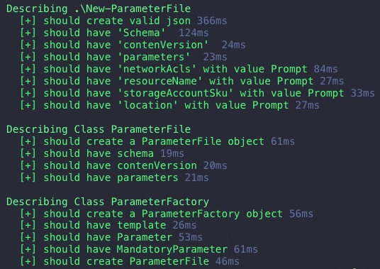

How do you create a Parameter File for your Azure Resource Manager template deployment?
In this post we are going to create a Parameter File generator using PowerShell Classes.
Furthermore we are looking into testing and validating your PowerShell Classes implementation.

## Learn Classes

If you are not yet familiar with the concepts of PowerShell Classes I can highly recommend the PSConfEU 2019 [Video: Learn Classes with Class {}](https://www.youtube.com/watch?v=hSk-ocD6VP4&t=1s) from [@Stephanevg](https://twitter.com/Stephanevg) go to [Video](#video)

## Parameter File Generator

I was looking for a way to create Azure Resource Manager template parameter files based on a given ARM template that can be used like this `New-ParameterFile` to jump to the code go to [Implementation](#implementation) or download [New-ParameterFile.ps1](/code/New-ParameterFile.ps1).

```powershell
New-ParameterFile
<#
{
  "schema": "https://schema.management.azure.com/schemas/2015-01-01/deploymentParameters.json#",
  "contenVersion": "1.0.0.0",
  "parameters": {
    "networkAcls": {
      "value": "Prompt"
    },
    "storageAccountAccessTier": {
      "value": "Prompt"
    },
    "storageAccountSku": {
      "value": "Prompt"
    },
    "location": {
      "value": "Prompt"
    },
    "resourceName": {
      "value": "Prompt"
    }
  }
}
#>
```

A parameter file contains sets of parameters that are used together with the Azure Resource Manager Template. However, a TemplateFile can specify parameters with a `defaultValue`, which is used for the deployment.

The [`New-AzResourceGroupDeployment`](https://docs.microsoft.com/en-us/powershell/module/az.resources/new-azresourcegroupdeployment?view=azps-2.5.0) can be executed with two parameters, e.g. `-ResourceGroupName` and `-TemplateFile`. Additionally you can overwrite default values by passing `-TemplateParameterFile` and a parameter file.

```powershell
$Deployment = @{
    ResourceGroupName = "MyResourceGroup"
    TemplateFile = (Join-Path $PSScriptRoot "azuredeploy.json").FullName
    TemplateParameterFile = (Join-Path $PSScriptRoot "azuredeploy.parameters.json").FullName
}
New-AzResourceGroupDeployment @Deployment
```

Also you cann add dynamic parameters to the deployment.
This object will set the parameters dynamically at execution time.
Object passed to the function will add dynamic parameters to the deployment.

```powershell
# Object will set the Parameter1 value to $Value using dynamic created parameter
# This object will override the Parameter1 Value if it is set in TemplateParameterFile too.

$Object = @{
    Parameter1 = $Value # Set Parameter1
}

$Deployment = @{
    ResourceGroupName = "MyResourceGroup"
    TemplateFile = (Join-Path $PSScriptRoot "azuredeploy.json").FullName
    TemplateParameterFile = (Join-Path $PSScriptRoot "azuredeploy.parameters.json").FullName
    # Will override duplicates in TemplateParamterFile
}
New-AzResourceGroupDeployment @Deployment @Object
```

## Implementation Considerations

With all that being said, we can consider not all parameters specified in an ARM template are needed for parameter file generation.
To implement these requirements the code needed some flexibility and extensibility, so I opted for a class first code approach.

I created a Plain PowerShell Object based on the schema of the [Azure Resource Manager Parameter template file](https://docs.microsoft.com/en-us/azure/azure-resource-manager/resource-manager-parameter-files). (The reference feature is not implemented to reduce complexity).

The `ParamterObject` class therefor implements the properties `schema`, `contenVersion` and `parameters`.
As the file expects to have the parameters name as a key a PowerShell hashtable for each parameter is used.
The hashtables key is the parameter name, this implementation converts nicely into the expected json when using `ConverTo-Json`.

A parameter file could contain all, none, a subset or only the _mandatory_ parameters specified in a given ARM template.
Having multiple different options for ParameterFiles the ParameterObject could be used as the abstract base class and concrete implementations could inherit the properties.

The `ParameterFileGenerator` takes a given template and exposes the builder method `GenerateParameterFile`. The method will create a parameter file string as json based on the template passed.
In this implementation you can specify to create a file with _mandatory_ parameters only or all parameters by specifying a flag.

Mandatory parameters are defined as parameters that do not implement the `defaultValues` property in the given ARM template.

## Implementation



## Usage

Now we created a function that can create Parameter Files of a given template.
The usage is pretty straight forward.

```powershell
# Functionality needs to dot source
. .\New-ParameterFile.ps1

New-ParameterFile
<#
{
  "schema": "https://schema.management.azure.com/schemas/2015-01-01/deploymentParameters.json#",
  "contenVersion": "1.0.0.0",
  "parameters": {
    "networkAcls": {
      "value": "Prompt"
    },
    "storageAccountAccessTier": {
      "value": "Prompt"
    },
    "storageAccountSku": {
      "value": "Prompt"
    },
    "location": {
      "value": "Prompt"
    },
    "resourceName": {
      "value": "Prompt"
    }
  }
}
#>

New-ParameterFile -OnlyMandatoryParameter
<#
{
  "schema": "https://schema.management.azure.com/schemas/2015-01-01/deploymentParameters.json#",
  "contenVersion": "1.0.0.0",
  "parameters": {
    "resourceName": {
      "value": "Prompt"
    },
    "networkAcls": {
      "value": "Prompt"
    }
  }
}
#>

# Or specify a path to the ARM template manually
$AzureDeployPath = "azuredeploy.json"
New-ParameterFile -Path $AzureDeployPath
New-ParameterFile -Path $AzureDeployPath -OnlyMandatoryParameter
```

## Test PowerShell classes

In order to test the functionality the whole implementation needs to be available in memory.
So PowerShell is aware of the classes and the functions.

Using `New-Fixture` command from the `Pester` module the whole script will be dot sourced.

After the classes are available in memory we can instantiate the class and execute its functionality.
As classes expect to implement the return, when not void, we can assert the functionality is executed as expected by asserting the returned value. Also, we can check the inner state by asserting the properties of the object.

{: .center-block :}

The end user facing function should be tested thoroughly.

Get the [New-ParameterFile.Tests.ps1](/code/New-ParameterFile.Tests.ps1)

```powershell
# New-ParameterFile.Tests.ps1

# this is created when running `New-Fixture`
$here = Split-Path -Parent $MyInvocation.MyCommand.Path
$sut = (Split-Path -Leaf $MyInvocation.MyCommand.Path) -replace '\.Tests\.', '.'
. "$here\$sut"

Describe "Class ParameterFile" {

    [array]$Parameters = @(
        @{
            Name = "Test1"
        },
        @{
            Name = "Test2"
        },
        @{
            Name = "Test3"
        }
    )
    it "should create a ParameterFile object" {
        [ParameterFile]::new($Parameters).GetType() | Should -Be "ParameterFile"
    }

    it "should have schema" {
        [ParameterFile]::new($Parameters).Schema | Should -Be "https://schema.management.azure.com/schemas/2015-01-01/deploymentParameters.json#"
    }

    it "should have contenVersion" {
        [ParameterFile]::new($Parameters).contenVersion | Should -Be "1.0.0.0"
    }

    it "should have parameters" {
        [ParameterFile]::new($Parameters).parameters | Should -Not -BeNullOrEmpty
    }
}


Describe "Class ParameterFileGenerator" {

    it "should create a ParameterFileGenerator object" {
        [ParameterFileGenerator]::new("$here\azuredeploy.json").GetType() | Should -Be "ParameterFileFactory"
    }

    it "should have template" {
        [ParameterFileGenerator]::new("$here\azuredeploy.json").template | Should -Not -BeNullOrEmpty
    }

    it "should have Parameter" {
        [ParameterFileGenerator]::new("$here\azuredeploy.json").Parameter | Should -Not -BeNullOrEmpty
        [ParameterFileGenerator]::new("$here\azuredeploy.json").Parameter.Count | Should -BeGreaterOrEqual 5
    }

    it "should have MandatoryParameter" {
        [ParameterFileGenerator]::new("$here\azuredeploy.json").MandatoryParameter | Should -Not -BeNullOrEmpty
        [ParameterFileGenerator]::new("$here\azuredeploy.json").MandatoryParameter.Count | Should -Be 2
    }

    it "should create ParameterFile" {
        $ParameterFile = [ParameterFileGenerator]::new("$here\azuredeploy.json").GenerateParameterFile($false)
        $ParameterFile.GetType() | Should -Be "ParameterFile"
        $ParameterFile | Should -Not -BeNullOrEmpty
    }
}


Describe ".\New-ParameterFile" {
    context "Valid Public Function Tests" {

        # Execute the user facing command first, as we want to make sure the user can run it
        $ParameterFile = New-ParameterFile

        # The command will return a JSON, so we convert it to assert on it
        $Json = $ParameterFile | ConvertFrom-Json -ErrorAction Stop -ErrorVariable JsonException

        # Basic sanity assertion to check if valid json is returned
        It "should create valid json" {
            $JsonException | Should -BeNullOrEmpty
        }

        $TestCases = @(
            @{
                Property = "Schema"
            },
            @{
                Property = "contenVersion"
            },
            @{
                Property = "parameters"
            }
        )
        it "should have <Property> " -TestCases $TestCases {
            Param(
                $Property
            )
            $Json.$Property | Should -Not -BeNullOrEmpty
        }


        $TestCases = @(
            @{
                Parameter = "networkAcls"
            },
            @{
                Parameter = "resourceName"
            },
            @{
                Parameter = "storageAccountSku"
            },
            @{
                Parameter = "location"
            }
        )
        it "should have <Parameter> with value Prompt" -TestCases $TestCases {
            Param(
                $Parameter
            )
            $Json.Parameters.$Parameter | Should -Not -BeNullOrEmpty
            $Json.Parameters.$Parameter.Value | Should -Be "Prompt"
        }
    }
}
```

In order to validate the code I used the example ADLS Gen2 [azuredeploy.json](/code/azuredeploy.json).

## Video

<div class="video-container">
    <iframe  src="https://www.youtube.com/embed/hSk-ocD6VP4" frameborder="0" allow="accelerometer; autoplay; encrypted-media; gyroscope; picture-in-picture" allowfullscreen></iframe>
</div>

## Remarks

## Table of contents

- [Learn Classes](#learn-classes)
- [Parameter File Generator](#parameter-file-generator)
- [Implementation Considerations](#implementation-considerations)
- [Implementation](#implementation)
- [Usage](#usage)
- [Test PowerShell classes](#test-powershell-classes)
- [Video](#video)
- [Remarks](#remarks)
- [Table of contents](#table-of-contents)
