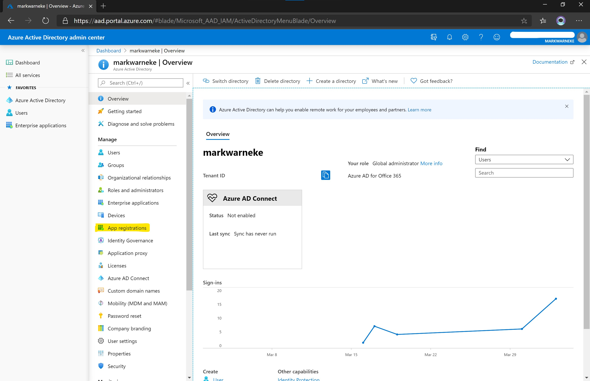
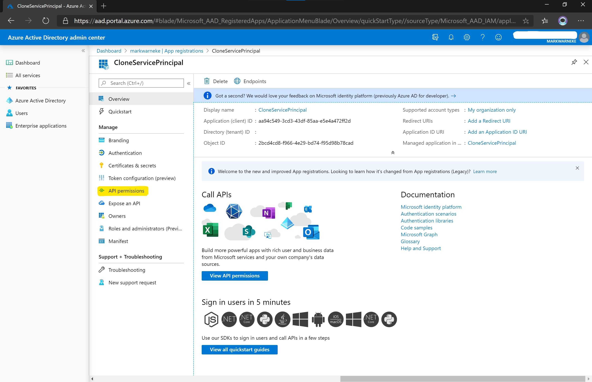
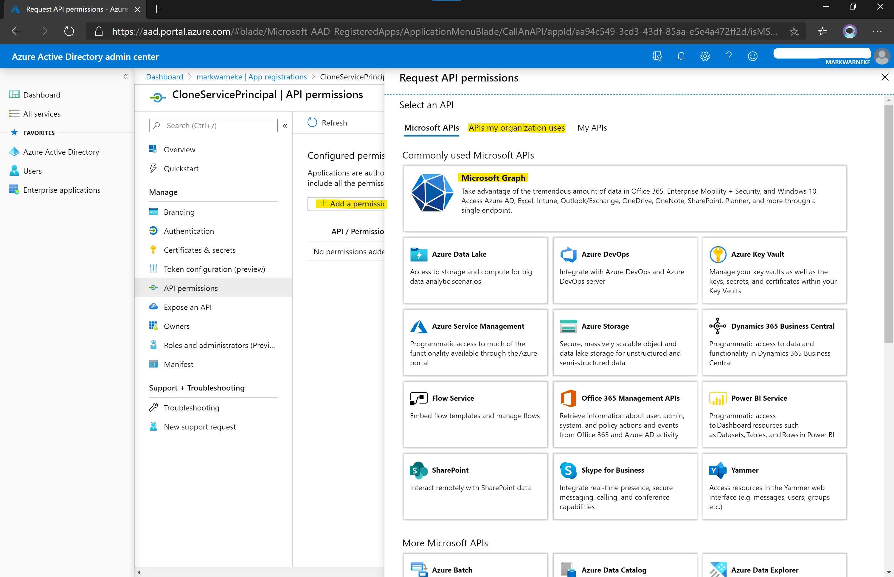
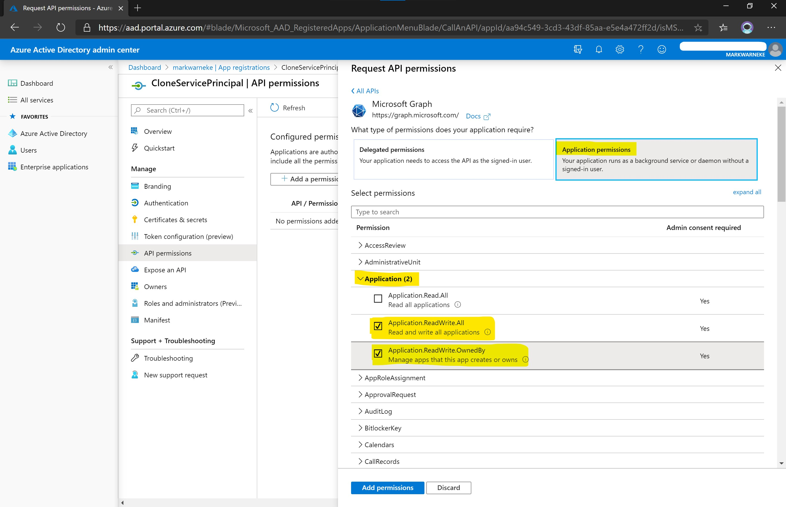
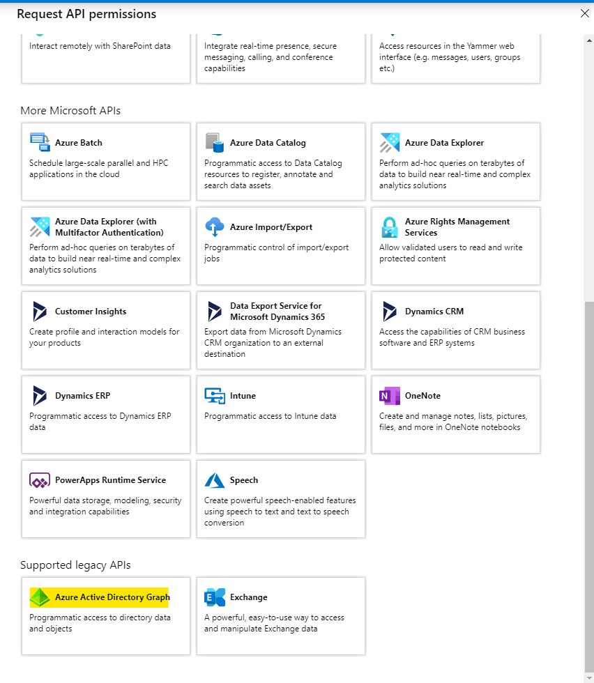
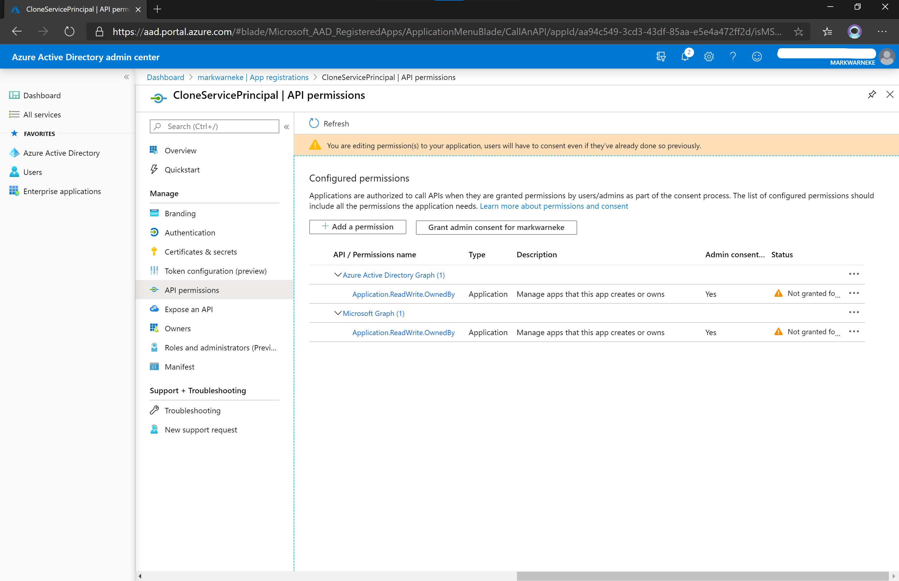

Have you ever tried to automate the creation of an Azure application registration or service principal object? In this blog post we are going to explore how to automate the creation of Azure AD objects using a *Clone Service Principal*. The service principal will be able to create other Azure AD service principals.

## Introduction

What is a service principal object? A service principal object is used

> to access resources that are secured by an Azure AD tenant, the entity that requires access must be represented by a security principal. This is true for both users (user principal) and applications (service principal). [Source](https://docs.microsoft.com/en-us/azure/active-directory/develop/app-objects-and-service-principals#service-principal-object)

For more information see [application and service principal objects in Azure Active Directory](https://docs.microsoft.com/en-us/azure/active-directory/develop/app-objects-and-service-principals).

Why is a **Clone Service Principal** needed? This type of serivce principal is needed if you want to automate the creation of Azure AD objects and decouples a dedicated *user principal* from the process of creating Azure AD objects. 

As speciall permissions are needed for a service principal to talk to the Azure AD APIs the blog posts tries to shed some light on how to create a least privileg service principal to create other service principals.

A use case for a *Clone Service Principal* is the automated creation of application registrations and service principals in a CI/CD pipeline. In deployment scripts for cloud native applcation and web applications. As well as the automated creation of landings zones for internal customers.

## Create a Clone Service Principal

In order to get started we can [create an Azure service principal with the Azure CLI](https://docs.microsoft.com/en-us/cli/azure/create-an-azure-service-principal-azure-cli?view=azure-cli-latest). It can either be a **tenant level account** (non RBAC, no Azure subscription assigned) or a `create-for-rbac` service principal. The steps to create an application registration and create a service principal object can be found below:

{: .box-warning}
**Note:** when creating the service principal, a password will be generated!
Consider that **the password will be in the output**! Make sure when running the creation in automation to deal with the secret accordingly, see [considerations](#considerations).

```bash
# Select a name
appName=CloneServicePrincipal

# Create an app and return only appId
appId=(az ad app create --display-name $appName --query appId -o tsv)

# Create a service principal using the returned app id
az ad sp create --id $appId
```

If you get the error message `"Insufficient privileges to complete the operation."`. Doublecheck the Azure AD settings ([aad.portal.azure.com](https://aad.portal.azure.com/#blade/Microsoft_AAD_IAM/ActiveDirectoryMenuBlade/UserSettings))  whether `User Settings` > **`App registrations`** > `Users can register Applications` is set to `Yes`.

If this setting is set to **`No`** you need to make sure your current user has at least the `Application developer` Azure AD role, for more information about Azure AD roles visit [roles and administrators](https://aad.portal.azure.com/#blade/Microsoft_AAD_IAM/ActiveDirectoryMenuBlade/RolesAndAdministrators).

{: .box-note}
**Application developer:** Users in this role will continue to be able to register app registrations even if the Global Admin has turned off the tenant level switch for "Users can register apps".

Using the `Application developer` role for the next steps will require an additional admin to consent to the following mandatory changes to the service principal permissions. Make sure user with `Application administrator` role is available in order to create the *Clone Service Principal* in [Application Permissions](#application-permissions).

If "User can register apps" is set to `No`. Make sure to also assign the role `Application developer` to the newly created service principal. Furthermore, the service principal needs to be granted explicit permissions on the API `Microsoft Graph` and `Azure Active Directory Graph` (see [API Permissions](#api-permissions)).

### Locate the service principal

Visit [aad.portal.azure.com](https://aad.portal.azure.com/#blade/Microsoft_AAD_IAM/ActiveDirectoryMenuBlade/RegisteredApps) and go to `Azure Active Directory` >
 `App Registrations`.



Locate the created service principal by searching `All applications` and navigate to `API Permissions`



Select `Add permissions`. You can search for APIs in the tab `APIs my organization uses`. Click on `Microsoft Graph` to list the API permissions.



### API Permissions

The permissions to create Azure AD objects are associated to two APIs. For each API the correct permissions need to be granted (see [Application Permissions](#application-permissions)). You can search for APIs in the `Request API permissions` > `APIs my organization uses`. You can use this form to reverse search the name for given API ID too (see json output in [wrap it up](#wrap-it-up)).

To create Azure AD objects the needed APIs are:

| API Name                       | API ID                               |
| ------------------------------ | ------------------------------------ |
| Microsoft Graph                | 00000003-0000-0000-c000-000000000000 |
| Windows Azure Active Directory | 00000002-0000-0000-c000-000000000000 |

### Application Permissions

We want to request  `Application permissions`, as our service principal should run as a background service or deamon without a signed-in user. (Note: delegated permission, in delegated scenarios, the effective permissions granted to your app may be constrained by the privileges of the signed-in user in the organization.). For details see [delegated permissions, Application permissions, and effective permissions](https://developer.microsoft.com/en-us/graph/graph/docs/concepts/permissions_reference#delegated-permissions-application-permissions-and-effective-permissions).

Select `Application permission`, locate `Application` in the drop down list and select `Application.ReadWrite.OwnedBy`, hit `Add permission` on the bottom and repeat the step for the Azure Active Directory API (!).



You can find the Windows Azure Active Directory API in the bottom of the list `Supported legacy APIs` in the portal.



The  permissions we are interested in granting are listed below. Review the following table for a detailed description of the differences between `All` and `OwnedBy`. Both permissions can be used for a *Clone Service Principal*.

| Permission                    | Description                                                                                                                                                                                                                                                                                                                                                                      | Admin Consent Required |
| ----------------------------- | -------------------------------------------------------------------------------------------------------------------------------------------------------------------------------------------------------------------------------------------------------------------------------------------------------------------------------------------------------------------------------- | ---------------------- |
| Application.ReadWrite.All     | Allows the calling app to create, and manage (read, update, update application secrets and delete) applications and service principals without a signed-in user. Does not allow management of consent grants or application assignments to users or groups.                                                                                                                      | Yes                    |
| Application.ReadWrite.OwnedBy | Allows the calling app to create other applications and service principals, and fully manage those applications and service principals (read, update, update application secrets and delete), without a signed-in user. It cannot update any applications that it is not an owner of. Does not allow management of consent grants or application assignments to users or groups. | Yes                    |

You can retrieve all permissions ids for the `Microsoft Graph` API by running a PowerShell command from the Azure AD module, thanks [Marco Scheel](https://marcoscheel.de/post/186138885112/app-permissions-f%C3%BCr-microsoft-graph-calls) see:

```powershell
# Make sure to install the module
Install-Module AzureAD

# Retrieve Microsoft Graph API permissions list
Get-AzureADServicePrincipal -filter "DisplayName eq 'Microsoft Graph'").AppRoles |
  Select Id, Value |
  Sort-Object Value
```

It returns a list of permissions Ids and Values. The whole list can be found as a download [markwarneke.me/application_permissions.json](https://markwarneke.me/application_permissions.json). In particular we are interested in the [Application resource permissions](https://docs.microsoft.com/en-us/graph/permissions-reference#application-resource-permissions). The Id and Value look like this:
 
```json
[
    {
        "Id": "1bfefb4e-e0b5-418b-a88f-73c46d2cc8e9",
        "Value": "Application.ReadWrite.All"
    },
    {
        "Id": "18a4783c-866b-4cc7-a460-3d5e5662c884",
        "Value": "Application.ReadWrite.OwnedBy"
    }
]
```

Up to this point the service principal is only request to be granted permissions to these APIs.
Some `API permissions` need admin consent, which means a high privileged Azure AD account needs to "approve" the requested permissions.

As we want to make changes in the Azure AD an admin has to acknowledge and consent to this. The `OwnedBy` permission is more restrictive and limits the changes to *owned* applications only.



You can find a list of permissions and whether admin consent is needed in the [Microsoft Graph permissions reference](https://docs.microsoft.com/en-us/graph/permissions-reference).

A high privileged role is for instance the `Application Administrator` Azure AD role, see [administrator role permissions in Azure Active Directory](https://docs.microsoft.com/en-us/azure/active-directory/users-groups-roles/directory-assign-admin-roles). Make sure to have a user principal with at least this role to grant admin consent on the requested permission (Global Administrator would work too).

> [The Application Adminsitrator] ... also grants the ability to consent to delegated permissions and application permissions, with the exception of permissions on the Microsoft Graph API. [Source](https://docs.microsoft.com/en-us/azure/active-directory/users-groups-roles/directory-assign-admin-roles#application-administrator)

If your user principal happens to be at least the Azure AD `Application Administrator` role you can hit `Grant admin consent for <tenant>`. Otherwise request the consent from from your administrator. Feel free to forward this blog post to your administrator to explain your intent; that is why I created this blog post in the first place.

## Using a Clone Service Principal to create other Service Principals

After the role  `Application developer` is assigned to the *Clone Service Principal*, and the application permissions for the API `Microsoft Graph` and `Azure Active Directory Graph` are granted we can try to use the *Clone Service Principal* to create other Azure AD objects.

To validate that the *Clone Service Principal* is working, log-in using the previously created service principal and try to create a new Azure AD application. The `az login --service-principal` is used to [sign in using a service principal](https://docs.microsoft.com/en-us/cli/azure/create-an-azure-service-principal-azure-cli?view=azure-cli-latest#sign-in-using-a-service-principal).

```bash
# Login as the Clone Service Principal
az login --service-principal -u $appId -p $passowrd --tenant $tenant

# Make sure you are actually using the service principal
az account show

# Create a new application
appName2=AppCreatedByCloneServicePrincipal
az ad app create --display-name $appName2
```

You should get the details of the application returned.

If an error is returned for `Insufficient privileges to complete the operation` make sure that the role and permissions are set correctly. Checkthat the changes have been propagated in Azure AD. In large Azure AD tenants, the propagation might take some time.

## Wrap it up

To create a *Clone Service Principal* you can run the following automation steps. Make sure the authenticated user executing the steps has at least the `Application Administrator` Azure AD role - as this role is needed for the last step to grant permissions.

```bash
# Make sure we are connected using a user principal that has Azure AD Admin permissions.
az logout
az login

# Name of the Clone Service Principal
appName="CloneServicePrincipal"

# Retrieve the teannt it
tenantId=$(az account show --query tenantId -o tsv)

# Create the Clone Service Principal
appId=$(az ad app create --display-name $appName --query appId -o tsv)
sp=$(az ad sp create --id $appId)

# Microsoft Graph API 
API_Microsoft_Graph="00000003-0000-0000-c000-000000000000"
# Application.ReadWrite.OwnedBy
PERMISSION_MG_Application_ReadWrite_OwnedBy="18a4783c-866b-4cc7-a460-3d5e5662c884"

# Azure Active Directory Graph API
API_Windows_Azure_Active_Directory="00000002-0000-0000-c000-000000000000"
# Application.ReadWrite.OwnedBy
PERMISSION_AAD_Application_ReadWrite_OwnedBy="824c81eb-e3f8-4ee6-8f6d-de7f50d565b7"

# Request Microsoft Graph API Application.ReadWrite.OwnedBy Permissions
az ad app permission add --id $appId --api $API_Microsoft_Graph --api-permissions $PERMISSION_MG_Application_ReadWrite_OwnedBy=Role

az ad app permission grant --id $appId --api $API_Microsoft_Graph --scope $PERMISSION_MG_Application_ReadWrite_OwnedBy

# Request Azure Active Directory Graph API Application.ReadWrite.OwnedBy Permissions
az ad app permission add --id $appId --api $API_Windows_Azure_Active_Directory --api-permissions $PERMISSION_AAD_Application_ReadWrite_OwnedBy=Role

az ad app permission grant --id $appId --api $API_Windows_Azure_Active_Directory --scope $PERMISSION_AAD_Application_ReadWrite_OwnedBy

# Grant Application & Delegated permissions through admin-consent
az ad app permission admin-consent --id $appId
```

Validate that the *Clone Service Principal* API permission has been assigned correctly, run:

```bash
az ad app permission list --id $appId
```

The output should look like this:

```json
[
  {
    "additionalProperties": null,
    "expiryTime": "",
    "resourceAccess": [
      {
        "additionalProperties": null,
        "id": "824c81eb-e3f8-4ee6-8f6d-de7f50d565b7",
        "type": "Role"
      }
    ],
    "resourceAppId": "00000002-0000-0000-c000-000000000000"
  },
  {
    "additionalProperties": null,
    "expiryTime": "",
    "resourceAccess": [
      {
        "additionalProperties": null,
        "id": "18a4783c-866b-4cc7-a460-3d5e5662c884",
        "type": "Role"
      }
    ],
    "resourceAppId": "00000003-0000-0000-c000-000000000000"
  }
]
```

- The  `resourceAppId` is the associated [API](#api-permissions), e.g. `Microsfot Graph`. 
- the `id` is the [Application permission](#application-permissions), e.g. `Application.ReadWrite.OwnedBy`.

### Test

Login using the new service principal. Notice the `--allow-no-subscriptions` is used because we set up a **tenant level account**, the account has no Azure subscription assigned and only operats on the tenant level Azure AD & Microsoft Graph APIs.

```bash
# Login using the Clone Service Principal
az login --service-principal -u $appId -p $pw --tenant $tenantId  --allow-no-subscriptions

# Create a new app
az ad app create --display-name "testmark2"
```

## Considerations

Make sure these steps are taken deliberately by creating a [thread model](https://www.microsoft.com/en-us/securityengineering/sdl/threatmodeling).

Allowing a service account to modify Azure AD objects has potential risks, here are some to consider:

- accidental deletion of Azure AD objects like application registrations.
- deliberate deletion of Azure AD objects by a rogue admin.
- creation of malicious application associated to the  Azure AD tenant.

Make sure the secrets for the *Clone Service Principal* are handeled correctly. 
A general guidance is to [store credentials in Azure Key Vault](https://docs.microsoft.com/en-us/azure/data-factory/store-credentials-in-key-vault). 
Ensure that these secrets are rotated frequently.

Monitor the [sign-in activity reports in the Azure Active Directory portal](https://docs.microsoft.com/en-us/azure/active-directory/reports-monitoring/concept-sign-ins) of the *Clone Service Principal* or consider creating alerts similar to [Role security > emergancy accounts](https://docs.microsoft.com/en-us/azure/active-directory/users-groups-roles/directory-emergency-access#monitor-sign-in-and-audit-logs) for unexpected sign-ins.

Create [Azure AD Identiy Governance](https://docs.microsoft.com/en-us/azure/active-directory/governance/identity-governance-overview) for the *Clone Service Principal*.
Make sure the created applications are active and used, recycle unused application periodically.

Consider the *Clone Service Principal* as a high privileged account and secure the secrets and access to it accordingly, see [improving security by protecting elevated-privilege accounts at Microsoft](https://www.microsoft.com/en-us/itshowcase/improving-security-by-protecting-elevated-privilege-accounts-at-microsoft) and [securing privileged access for hybrid and cloud deployments in Azure AD](https://docs.microsoft.com/en-us/azure/active-directory/users-groups-roles/directory-admin-roles-secure).
