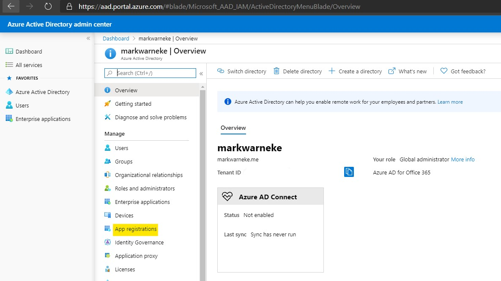
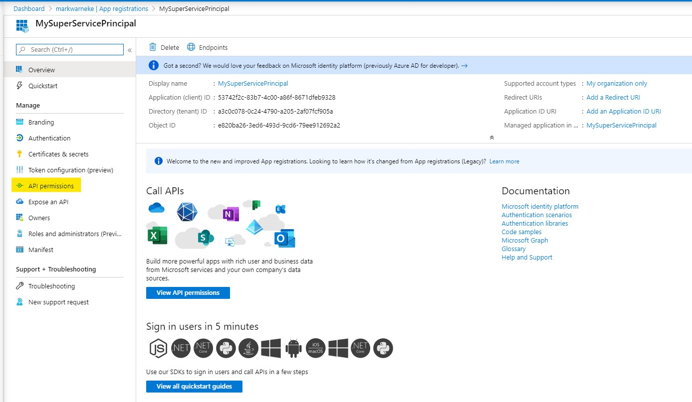
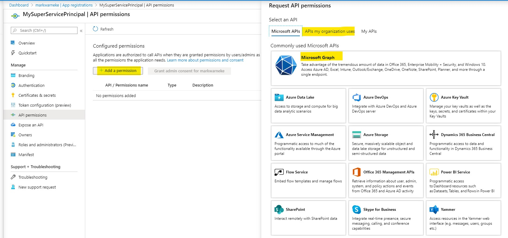
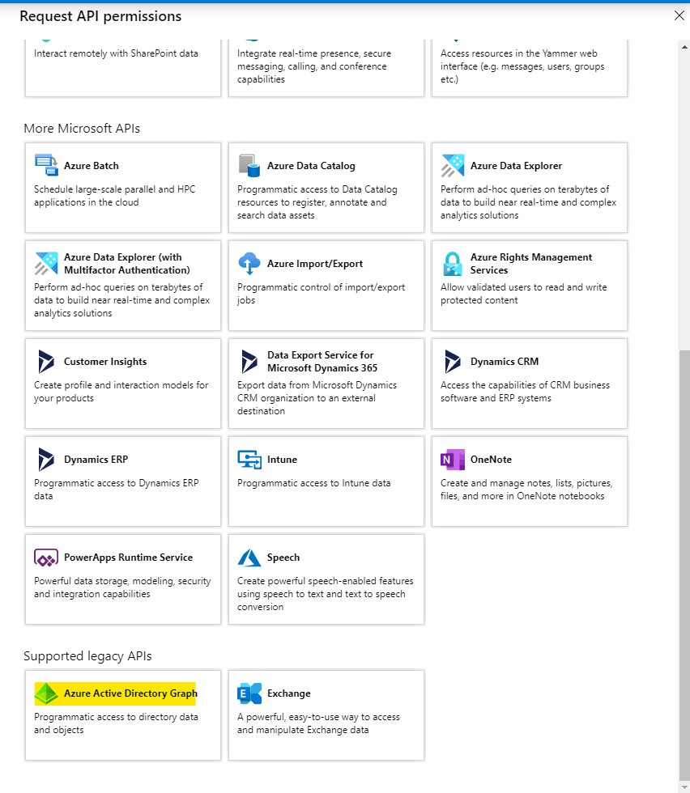
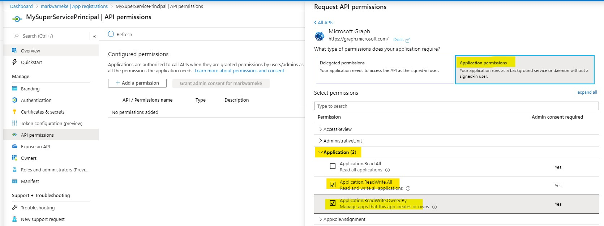
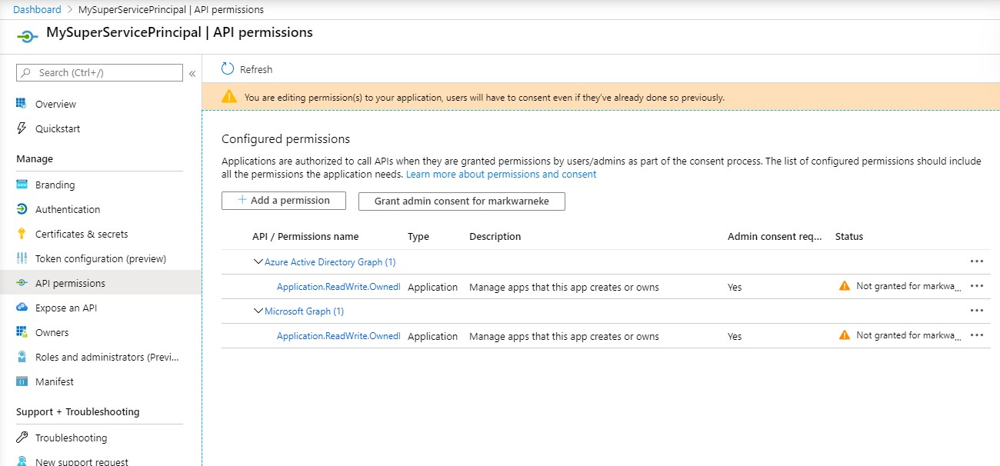

have you ever tried to automate the creation of application registrations and service principal objects? In this blog post we are going to look into how we can automate the creation of AzureAD objects using, what I refer to as, a *Super Service Principal*. A super serivce principal will allow you to create other service principals.

# Introduction

What is a service principal object? A Service principal object is used

> to access resources that are secured by an Azure AD tenant, the entity that requires access must be represented by a security principal. This is true for both users (user principal) and applications (service principal). [docs](https://docs.microsoft.com/en-us/azure/active-directory/develop/app-objects-and-service-principals#service-principal-object)

For more information see [application and service principal objects in Azure Active Directory](https://docs.microsoft.com/en-us/azure/active-directory/develop/app-objects-and-service-principals)

## Create a super service principal

In order to get started quickly we can [create an Azure service principal with the Azure CLI](https://docs.microsoft.com/en-us/cli/azure/create-an-azure-service-principal-azure-cli?view=azure-cli-latest). Or we can create a tenant level account (non rbac, no subscription assigned). The steps to create an application registration and create a service principal object can be found below:


> Notice, when creating the service principal a password is generated, make sure to store this password securly as you are not going to be able to retriev it. The only option get to the secret will be to reset the password. Also (!), consider the output when running in automation, e.g. a pipline. Make sure to deal with the secret output accordingly.


```bash
# Select a name
$app_name=MarkWarneke

# Create an app
az ad app create --display-name $app_name

# Create a service principal using the returned app id
az ad sp create --id $appId 
```

If you get the error message `"Insufficient privileges to complete the operation."`. Doublecheck AzureAD ([aad.portal.azure.com](https://aad.portal.azure.com/#blade/Microsoft_AAD_IAM/ActiveDirectoryMenuBlade/UserSettings)) settings whether **App registrations** (Users can register applicaitons) is set to `Yes`. 

If this setting is set to **No** you need to make sure your current user has at least the `Application developer` AzureAD role, for more information about AzureAD roles visit [Roles and administrators](https://aad.portal.azure.com/#blade/Microsoft_AAD_IAM/ActiveDirectoryMenuBlade/RolesAndAdministrators). 

> Application developer: Users in this role will continue to be able to register app registrations even if the Global Admin has turned off the tenant level switch for "Users can register apps".

The `Application developer` role will require an additional admin to consent to the following mandatory changes. Make sure you have an account with `Application administrator` role available to create a super service principal (more on that later).

If "User can register apps" is set to `No`. Make sure to also assign the role `Application developer` to the newly created service principal too. Furthermore, the serivce principal needs to be granted explicit permisisons on the API `Microft Graph` and `Azure Active Driectory Graph`.

### Located the service principal

Visit [aad.portal.azure.com](https://aad.portal.azure.com/#blade/Microsoft_AAD_IAM/ActiveDirectoryMenuBlade/RegisteredApps) and go to `Azure Active Directory` >
 `App Registrations`.
 

 
 Located the created service principal by searching `All applicaitons` and navigate to `API Permissions`
 
 .

 Select `Add permissions`, you can search for APIs id in `APIs my organization uses`. Click on `Microsoft Graph`.
 
 .
 
### API Permissions

The permissions to create service principals are associated to a specifc APIs. Thus, for each API the permisisons needs to be granted. You can search for the API in the `Request API permisisons` > `APIs my organization uses`. 

To create service principals the needed APIs are:

| API Name                       | Application ID                       |
| ------------------------------ | ------------------------------------ |
| Microsoft Graph                | 00000003-0000-0000-c000-000000000000 |
| Windows Azure Active Directory | 00000002-0000-0000-c000-000000000000 |

You can find the Windows Azure Active Directory API in the bottom of the list `Supported legacy APIs`.



### Application Permissions

We want to request  `Application permissions`, as our service principal should run as a background service or deamon without a signed-in user. (Note: delegated permisison, in delegated scenarios, the effective permissions granted to your app may be constrained by the privileges of the signed-in user in the organization.). For details see [delegated permissions, Application permissions, and effective permissions](https://developer.microsoft.com/en-us/graph/graph/docs/concepts/permissions_reference#delegated-permissions-application-permissions-and-effective-permissions).

Select `Application permission`, lcoate `Applicaiton` in the drop down list and select `Application.ReadWrite.OwnedBy`, hit `Add permission` and repeat the step for the second API (!).



The  permisisons we are interested in granting are listed below. See the following table for more detailed descirption of what the permisisons grants. Depending on the granularity you want select `all` or `OwnedBy`. Both permissions can be used for a super serive principal.

| Permission                    | Description                                                                                                                                                                                                                                                                                                                                                                      | Admin Consent Required |
| ----------------------------- | -------------------------------------------------------------------------------------------------------------------------------------------------------------------------------------------------------------------------------------------------------------------------------------------------------------------------------------------------------------------------------- | ---------------------- |
| Application.ReadWrite.All     | Allows the calling app to create, and manage (read, update, update application secrets and delete) applications and service principals without a signed-in user. Does not allow management of consent grants or application assignments to users or groups.                                                                                                                      | Yes                    |
| Application.ReadWrite.OwnedBy | Allows the calling app to create other applications and service principals, and fully manage those applications and service principals (read, update, update application secrets and delete), without a signed-in user. It cannot update any applications that it is not an owner of. Does not allow management of consent grants or application assignments to users or groups. | Yes                    |

You can retrieve all permissions ids for the `Microsoft Graph` API by running a PowerShell command from the AzureAD module, thanks [Marco Scheel](https://marcoscheel.de/post/186138885112/app-permissions-f%C3%BCr-microsoft-graph-calls) see:

```powershell
# Make sure to instal the module
Install-Module AzureAD

# Retrieve Microsoft Graph API permisisons list
(Get-AzureADServicePrincipal -filter "DisplayName eq 'Microsoft Graph'").AppRoles | Select Id, Value | Sort-Object Value
```

It returns a list of [permissions](https://markwarneke.me/application_permissions.json) Ids and Values. The wholel ist can be found here [markwarneke.me/application_permissions.json](https://markwarneke.me/application_permissions.json). In particular we are interested in the `Application` related permissions. The Id and Value look like this:
 
```json
[
    {
        "Id": "1bfefb4e-e0b5-418b-a88f-73c46d2cc8e9",
        "Value": "Application.ReadWrite.All"
    },
    {
        "Id": "18a4783c-866b-4cc7-a460-3d5e5662c884",
        "Value": "Application.ReadWrite.OwnedBy"
    }
]
```

Up to this point the service principal is only request to be granted permissions to these APIs.
Some `API permisisons` need admin consent, which means a high privileged Azure AD role needs to "approve" these permissions request.
As we want to have write action on the AzureAD the permissions we are looking for need higher privilege.



You can find a list of permissions and whether admin consent is needed here [Microsoft Graph permissions reference](https://docs.microsoft.com/en-us/graph/permissions-reference). We are specifically interested in the [Application resource permissions](https://docs.microsoft.com/en-us/graph/permissions-reference#application-resource-permissions).

A high privileged role is for instance the `Application Administrator` Azure AD role, see [administrator role permissions in Azure Active Directory](https://docs.microsoft.com/en-us/azure/active-directory/users-groups-roles/directory-assign-admin-roles). Make sure to have a user principal with at least this role to grant admin consent on the requested permission (Global Adminstrator would work too).

> [The Application Adminsitrator] ... also grants the ability to consent to delegated permissions and application permissions, with the exception of permissions on the Microsoft Graph API. [docs](https://docs.microsoft.com/en-us/azure/active-directory/users-groups-roles/directory-assign-admin-roles#application-administrator)

If your user principal happens to be at least the AzureAD `Application Adminstrator` role you can hit `Grant admin consent for <tenant>`. Otherwise request the consent from from you adminstrator. Feel free to forward this blog post to your administrator to explain your intent.

## Using a Super Service Principal to create Service Principals

After the role  `Application developer` is assigned as a role to the super service principal, and the Application permissions for the API `Microsoft Graph` and `Azure Active Directory Graph` are at least granted for  `Application.ReadWrite.OwnedBy`. We can use the super service principal to create other applicaitons.

To validate that we created a **super service principle**, log-in as the previoulsy created Service Principal and try to create a new application. The `az login --service-principal` is used log-in.

```bash
# Login as the super servie principal
az login --service-principal -u $appId -p $passowrd --tenant $tenant

# Make sure you are actually using the service principal
az account show

# Create a new application
$app_name_2=AppCreatedBySuperServicePrincipal
az ad app create --display-name $app_name_2
```

You should get the detailes of the application returned. If you see `Insufficient privileges to complete the operation.` make sure that the role and permissieeons are set correctly and that the changes have been propagated in Azure AD. In large Azure AD tenants the propagation might take some time.

## Wrap it up

To create a super serivice principal you can run the following steps.


```bash
# Make sure we are connected using a user principal that has Azure AD Admin permissions.
az logout
az login

# Name of the super service principal
appName="MySuperServicePrincipal"

# Retrieve the teannt it
tenantId=$(az account show --query tenantId -o tsv)

appId=$(az ad app create --display-name $appName --query appId -o tsv)
sp=$(az ad sp create --id $appId)

# Microsoft Graph API 
API_Microsoft_Graph="00000003-0000-0000-c000-000000000000"
# Application.ReadWrite.OwnedBy
PERMISSION_MG_Application_ReadWrite_OwnedBy="18a4783c-866b-4cc7-a460-3d5e5662c884"

# Azure Active Directory Graph API
API_Windows_Azure_Active_Directory="00000002-0000-0000-c000-000000000000"
# Application.ReadWrite.OwnedBy
PERMISSION_AAD_Application_ReadWrite_OwnedBy="824c81eb-e3f8-4ee6-8f6d-de7f50d565b7"

# Request Microsoft Graph API Application.ReadWrite.OwnedBy Permissions
az ad app permission add --id $appId --api $API_Microsoft_Graph --api-permissions $PERMISSION_MG_Application_ReadWrite_OwnedBy=Role
az ad app permission grant --id $appId --api $API_Microsoft_Graph --scope $PERMISSION_MG_Application_ReadWrite_OwnedBy
    
# Request Azure Active Directory Graph API Application.ReadWrite.OwnedBy Permissions
az ad app permission add --id $appId --api $API_Windows_Azure_Active_Directory --api-permissions $PERMISSION_AAD_Application_ReadWrite_OwnedBy=Role
az ad app permission grant --id $appId --api $API_Windows_Azure_Active_Directory --scope $PERMISSION_AAD_Application_ReadWrite_OwnedBy

# Grant Application & Delegated permissions through admin-consent
az ad app permission admin-consent --id $appId
```

Validate that the super service principal API permission has been assignment by running:

```bash
az ad app permission list --id $appId
```

```json
[
  {
    "additionalProperties": null,
    "expiryTime": "",
    "resourceAccess": [
      {
        "additionalProperties": null,
        "id": "824c81eb-e3f8-4ee6-8f6d-de7f50d565b7",
        "type": "Role"
      }
    ],
    "resourceAppId": "00000002-0000-0000-c000-000000000000"
  },
  {
    "additionalProperties": null,
    "expiryTime": "",
    "resourceAccess": [
      {
        "additionalProperties": null,
        "id": "18a4783c-866b-4cc7-a460-3d5e5662c884",
        "type": "Role"
      }
    ],
    "resourceAppId": "00000003-0000-0000-c000-000000000000"
  }
]
```

### Test

Login using the new service principal

```bash
# Login using the super service principal
az login --service-principal -u $appId -p $pw --tenant $tenantId  --allow-no-subscriptions

# Create a new app
az ad app create --display-name "testmark2"
```
