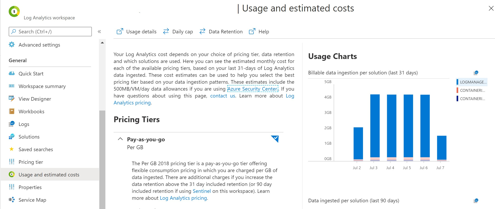

If you wonder about the usage and estimated costs of you Azure Kubernetes (AKS) service log analytics or the cost for monitoring  data retained and data collected seem to be extremely high this blog post will help investigate the cost drivers and help identify the source.

## Identify Categories

 Looking at the usage and estimate the **LogManagement** category seems to be the biggest cost driver with 80% data retention



Drilling into the `LogManagement` category, we can see that **AzureDiagnostics** is the biggest category using

```sql
Usage | where TimeGenerated > startofday(ago(31d))| where IsBillable == true
| where TimeGenerated > startofday(ago(31d))
| where IsBillable == true
| summarize BillableDataGB = sum(Quantity) / 1000. by bin(TimeGenerated, 1d), DataType | render barchart
```


Using the follow Kusto query we can see that AzureDiagnostics has 10GB of BillableDataGB vs 2GB for Perf Data.

```sql
Usage 
| where TimeGenerated > startofday(ago(31d))
| where IsBillable == true
| summarize BillableDataGB = sum(Quantity) by Solution, DataType
| sort by BillableDataGB desc
```


## Identify Resource

Looking into the ResourceProvider we can see that **CONTAINERSERVICE** is the main contributor to the logs using

```sql
AzureDiagnostics | summarize AggregatedValue = count() by ResourceProvider, ResourceId
```

Result:

```yaml
MICROSOFT.KEYVAULT:	8,122	
MICROSOFT.CONTAINERSERVICE:	1,894,579	
```

## Identify Diagnostic Category

Inside the AzureDiagnostics logs we can investigate the **log_s** using

```sql
AzureDiagnostics | extend logs = parse_json(log_s) | project logs.apiVersion, logs
```

The logs contain the apiVersion **audit.k8s.io/v1**. Looking into the configured diagnostics settings of the resource group we can investigate which category is selected. 

## Identify K8S Namespace

Based on the logs we can create a PieChart that prints the data used per namespace in order to investigate what kind of logs are driving the biggest amount of data generated. (Thanks [@Vishwanath](https://medium.com/@visnara) for the query)

```sql
let startTime = ago(1h);
let containerLogs = ContainerLog
| where TimeGenerated > startTime
| where _IsBillable == true
| summarize BillableDataMBytes = sum(_BilledSize)/ (1000. * 1000.) by LogEntrySource, ContainerID;
let kpi = KubePodInventory
| where TimeGenerated > startTime
| distinct ContainerID, Namespace;
containerLogs
| join kpi on $left.ContainerID == $right.ContainerID
| extend sourceNamespace = strcat(LogEntrySource, "/", Namespace)
| summarize MB=sum(BillableDataMBytes) by sourceNamespace
| render piechart
```


Based on the chart we can see that a lot of data is generated in the stderr and stdout of the namespaces. Now we can look into the application in the particular namespace to determine what kind of logs are being generated.

## Reducing Cost

A quick fix is to turn of the diagnostics settings of the Kubernetes Service, disabling the diagnostics will not generate any further data. The data already generated will continue to be charged based on the Data Retention.

We can tweak the applications log level or fix any error that is generate the stderr logs. A container in a constant crash loop can generate huge amount of data if not dealt with.

Use Azure Monitors Insights for Containers overview to identify any unhealthy clusters quickly.

[portal.azure.com/#blade/Microsoft_Azure_Monitoring/AzureMonitoringBrowseBlade/containerInsights](https://portal.azure.com/#blade/Microsoft_Azure_Monitoring/AzureMonitoringBrowseBlade/containerInsights)

 

You can follow [Controlling ingestion to reduce cost](https://docs.microsoft.com/en-us/azure/azure-monitor/insights/container-insights-cost) for official guidance.

# Resources

- [Azure Monitor for Containers — Optimizing data collection settings for cost](https://medium.com/microsoftazure/azure-monitor-for-containers-optimizing-data-collection-settings-for-cost-ce6f848aca32)
- [Configure agent data collection for Azure Monitor for containers](https://docs.microsoft.com/en-us/azure/azure-monitor/insights/container-insights-agent-config)
- [Understand monitoring costs for Azure Monitor for containers](https://docs.microsoft.com/en-us/azure/azure-monitor/insights/container-insights-cost)