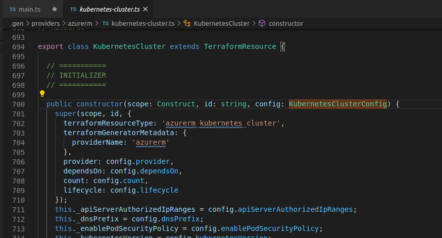
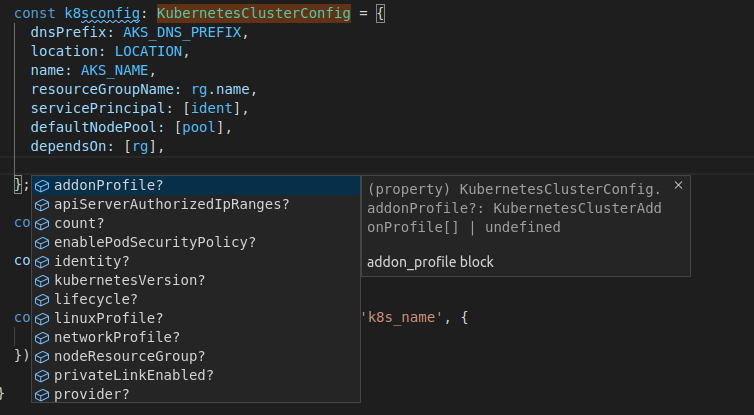

HashiCorp recently announced [CDK for Terraform: Enabling Python and TypeScript Support](https://www.hashicorp.com/blog/cdk-for-terraform-enabling-python-and-typescript-support/) - _CDK_ stands for **Cloud Development Kit**, CDK enables Cloud Engineers to define their Infrastructure as Code (IaC) using programming languages like TypeScript or Python.

CDK currently consists of a new CLI and a library for defining Terraform resources using TypeScript or Python in order to generates Terraform configuration files that can be used to provisioning resources.

CDK is currently implemented in Node and can be installed using `npm install -g cdktf-cli` see [Getting Started](https://github.com/hashicorp/terraform-cdk#getting-started) on the official repo.

In this blog-post I will dive into the CDK leveraging the existing Azure providers in order to create an Azure Kubernetes Service (AKS) using TypeScript.
The code can be found on my [github.com/MarkWarneke](https://github.com/MarkWarneke/cdk-typescript-azurerm-k8s).

## Cloud Development Kit (CDK) for Terraform on Azure

The CDK for Terraform compliments the exiting Terraform ecosystem, based on JSON and HCL.


Lets explor the [`cdktf`](https://github.com/hashicorp/terraform-cdk/blob/master/docs/cli-commands.md) cli commands.

```shell
cdktf [command]

Commands:
  cdktf deploy [OPTIONS]   Deploy the given stack
  cdktf destroy [OPTIONS]  Destroy the given stack
  cdktf diff [OPTIONS]     Perform a diff (terraform plan) for the given stack
  cdktf get [OPTIONS]      Generate CDK Constructs for Terraform providers and modules.
  cdktf init [OPTIONS]     Create a new cdktf project from a template.
  cdktf login              Retrieves an API token to connect to Terraform Cloud.
  cdktf synth [OPTIONS]    Synthesizes Terraform code for the given app in a directory. [aliases: synthesize]

Options:
  --version          Show version number [boolean]
  --disable-logging  Dont write log files. Supported using the env CDKTF_DISABLE_LOGGING.                                                                             [boolean] [default: true]
  --log-level        Which log level should be written. Only supported via setting the env CDKTF_LOG_LEVEL [string]
  -h, --help         Show help [boolean]

Options can be specified via environment variables with the "CDKTF_" prefix (e.g. "CDKTF_OUTPUT")
```

To get started create a new folder and run `cdktf init --template="typescript"`, this will generate a blueprint TypeScript file structure.

The output is a bunch of files, including the known `main` (in this case `main.ts` instead of `main.tf`) and the CDK configuration file `cdktf.json`. Lets add the `azurerm` provider to the file.

```json
{
  "language": "typescript",
  "app": "npm run --silent compile && node main.js",
  "terraformProviders": ["azurerm@~> 2.0.0"]
}
```

The [`terraformProviders`](https://www.terraform.io/docs/providers/) can be explored in the registry e.g. [`azurerm`](https://registry.terraform.io/providers/hashicorp/azurerm/latest)

To follow along add `"azurerm@~> 2.0.0"` to the `cdkf.json`. Then run `cdktf get` in order to install the Azure provider.

Make sure to log-in to Azure using the az cli `az login`.
The interactive `cdktf` similar to `terraform` will use the current Azure context by default.

## Deploy Kubernetes on Azure using TypeScript

After the providers have been fetched the provider can be explored in `.gen/providers/azurerm`. You can find all available resources definition here, Kubernetes can be found using `ls ./.gen/providers/azurerm | grep "Kubernetes"`.

Lets look at the `TerraformResource` implementation of `KubernetesCluster`. To see the implementation display `kubernetes-cluster.ts` using `less ./.gen/providers/azurerm/kubernetes-cluster.ts` or browse the file in your editor.

You are looking for the exported class: `export class KubernetesCluster extends TerraformResource`.



In order to use the Kubernetes `TerraformResource` declare the class in `main.ts`. First add the dependency to the imports using `import { AzurermProvider, KubernetesCluster} from './.gen/providers/azurerm'`.

The `main.ts` could look somewhat like this:

```typescript
import { Construct } from "constructs";
import { App, TerraformStack, TerraformOutput } from "cdktf";
import { AzurermProvider, KubernetesCluster } from "./.gen/providers/azurerm";

class K8SStack extends TerraformStack {
  constructor(scope: Construct, name: string) {
    super(scope, name);

    // Register the AzureRmProvider, make sure to import its
    const provider = new AzurermProvider(this, "AzureRm", {
      features: [{}],
    });

    // ...

    new KubernetesCluster(this, "k8scluster", {
      // ... KubernetesClusterConfig
    });
  }
}

const app = new App();
const k8tstack = new K8SStack(app, "typescript-azurerm-k8s");
app.synth();
```

`TerraformResource` accepts a `scope`, `id` and a `config`. The config is depending on the resource to be provisioned and the class name is based on the resource add `Config` to the end. For Kubernetes we are looking for the `KubernetesClusterConfig`.

In this example the `scope` is set to the current stack using `this`, the `id` is similar to the resource name in terraform and should be a unique name. The `config` is an implementation of `TerraformMetaArguments`, lets see how to use the `KubernetesClusterConfig`.

### Define the KubernetesClusterConfig

The `KubernetesClusterConfig` is an interface that describes the `TerraformMetaArguments` for a Kubernetes cluster.

```typescript
export interface KubernetesClusterConfig extends TerraformMetaArguments
```

The interface describes the properties of the configuration. Leveraging a code editor like VSCode shift-clicking `KubernetesClusterKubeConfig` will reveal the implementation.

We can see which properties of the configuration are mandatory and which are optional. Optional properties are postfixed with a question-mark `?`, e.g. `readonly apiServerAuthorizedIpRanges?: string[];`.

We can also use intellisense to suggest and displays missing variables. For instance the minimum config looks like this:

```typescript
const k8sconfig: KubernetesClusterConfig = {
  dnsPrefix: AKS_DNS_PREFIX,
  location: LOCATION,
  name: AKS_NAME,
  resourceGroupName: rg.name,
  servicePrincipal: [ident],
  defaultNodePool: [pool],
  dependsOn: [rg],
};
```

We can double-check the official terraform provider docs for a Kubernetes cluster [terraform.io/azurerm_kubernetes_cluster](https://www.terraform.io/docs/providers/azurerm/r/kubernetes_cluster.html) and see that the config values are matching the mandatory parameter of the argument reference.

Suppose we missed a mandatory property the TypeScript compiler will throw an error and indicate early that an attribute has been missed. This is a major benefit of the strongly typed programming language TypeScript over a loose configuration file.

To create a config element use `let NAME: Type = {}`. The TypeScript object can then be extended based on conditions with additional properties, just like any TypeScript object.

The editor can be used to autocomplete e.g. using shift space, to display additional properties of the given object.



> Caveat: a Terraform Azure Kubernetes Cluster typically can be provisioned using a `servicePrincipal` or `identity`. They are mutually exclusive and one of them has to be defined, using the current `KubernetesClusterConfig` only the `servicePrincipal` property is mandatory and thus `identity` can not be used`

### Leverage Environment Variables

Environment variables can be used to inject variables to a CDK implementation. In Node you can use `process.env` e.g. `process.env.AZ_SP_CLIENT_ID` and `process.env.AZ_SP_CLIENT_SECRET`.

```typescript
const ident: KubernetesClusterServicePrincipal = {
  clientId: process.env.AZ_SP_CLIENT_ID as string,
  clientSecret: process.env.AZ_SP_CLIENT_SECRET as string,
};
```

This allows us to change configuration between deployments without changing the code based on [the Twelve-Factor App](https://12factor.net/) App. The environment variables can be set using

```bash
export AZ_SP_CLIENT_ID=''
export AZ_SP_CLIENT_SECRET=''
```

### Generate Terraform

The CDK is used to generate a Terraform file. The process of generating an IaC file is called synthesizing.
The cli can be used to run `cdktf synth`.
This will create a `cdktf.out` directory.
In the directory, we can review the create Terraform file `./cdktf.out/cdk.tf.json`.

The full CDK AKS implementation looks like this:



`cdktf synth` can also be run with `-o` to specify the output file or using `-json` to just print the created Terraform file to the console. The `cdktf` generates `json` because it is not necessary to be [human-readable](https://www.hashicorp.com/blog/terraform-0-12-reliable-json-syntax/). Terraform work with both `hcl` (`.tf`) and `json` (`.json`) files.

Exploring the `cdk.tf.json` file we can see the familiar Terraform structure. All resources are present including the values & the previously set values of the environment variables e.g. the service principal id and secret.

> Secrets are visible here. Make sure to use appropriate measures to prevent leaking them. Like Azure Key Vault e.g. [`azure_key_vault_secret`](https://www.terraform.io/docs/providers/azurerm/r/key_vault_secret.html) to store and retrieve secrets securely. Checking-In the output of the synth step should be prevented, e.g. through a `.gitignore` file.

We can run `cdktf diff` similar to `terraform diff` to display the changes to be made before applying them. We can also explore the terraform state in the root folder `terraform.tfstate`. The state can be configured e.g. in a remote backend following the docs for [Terraform Remote Backend](https://github.com/hashicorp/terraform-cdk/blob/master/docs/working-with-cdk-for-terraform/remote-backend.md)

### Get it Running

```bash
# Login to Azure, in order to set the local terraform context
az login

# Export the "not so" secret environment variables
export AZ_SP_CLIENT_ID=''
export AZ_SP_CLIENT_SECRET=''

# Generate the terraform deployment file
cdktf synth

# Run the diff to see planned changes
cdktf diff

# Run terraform apply using the generated deployment file
cdktf deploy

# Destroy the deployment using
cdktf destroy
```

As the CDK is used to generate Terraform deployment files, we can use output with familiar Terraform-CLI commands.

Go to `cdktf.out` and run `terraform validate`, `terraform plan` and `terraform apply`, this is the magic behind [synthesizing Terraform Configuration using CDK for Terraform CLI](https://github.com/hashicorp/terraform-cdk/blob/master/docs/working-with-cdk-for-terraform/synthesizing-config.md). This tooling generates valid Terraform code that can be easily added to existing IaC projects. Previously created pipelines can still be used to deploy infrastructure as we are used to with terraform.

We can leverage CDK to abstract the deployment file creation to a higher-level programming language without investing too much into refactoring existing tools and pipelines and without losing any of the benefits of IaC configuration files.

## Lookout

Because a programming language is used we can leverage a couple of tools that have been missing to the IaC development lifecycle.

### Compiler

The use of the strongly typed TypeScript language as an intermediary can be used to catch configuration errors early by using the TypeScript compiler in the developer's inner-loop. Running `tsc` in the root folder will display any TypeScript errors immediately.

Missing mandatory variable or wrong assignments are for the past.

### Linter

Tools like `tslint` can be used to run statical code-analysis and ensure inconsistencies and errors are caught early. Running `tslint -c tslint.json main.ts` will display any violation of the configured rules. Linters can also be used to unify a codebase, this is especially interesting with multiple contributors to the same code.

### Libraries and Tools

Tools and libraries like [`hcl2json`](https://www.npmjs.com/package/hcl2json) or `json2hcl` can be used to extend and add on top of the CDK.

### Debuggers

Furthermore, because a programming language is used we can attach debuggers to our development workflow.


(In VSCode open `main.ts` > Run the debugger with `F5` > Select Environment `Node.js`)

Troubleshooting the assignment of variables, understanding complex loops and conditions as well as resolving dependency trees are way easier to resolve by leveraging a debugger. Resolving errors should be less tedious because existing and battle-tested software-development tools can finally be used.

### Tests

Complex templates can be broken into small reusable pieces. A complex Terraform deployment can be constructed dynamically. Multiple modules can be composed using loops and conditions. The amount of configuration code can be reduced significantly. Unit tests can be applied to ensure that the generated templates are correct and consistent.

### Outlook

The combination of parameterized Terraform modules and the usage of the CDK can abstract deployments into simple to use services, like command-line tools, shared APIs and web services. These services create reproducible IaC based on configuration data that can even be stored in databases.

Custom validation and enforcing naming-convention thorough custom code can be used to scale and mature IaC projects further.

The flexibility of a full programming language meets the idempotent and declarative nature of IaC.
