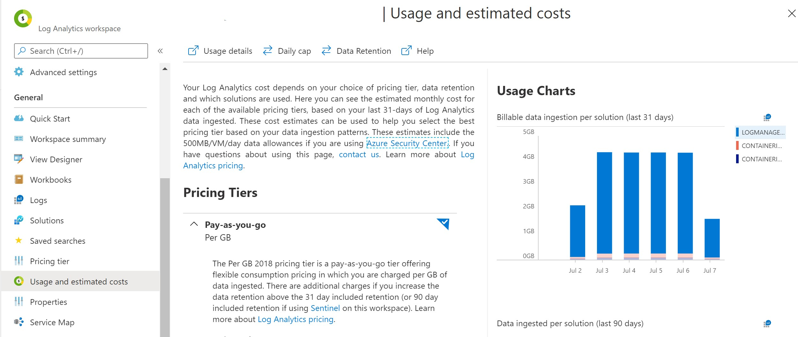

In this post we are going to look into how you can configure your LogManagement data ingestion from Kubernetes.
We will configure the OMSAgent of Kubernetes LogManagement to only ingest relevant namespaces into the Log Analytics workspace.

When the major cost driver is LogManagement and the usage charts displays unusual high billable data ingestion per solution in the Azure Log Analytics usage and estimated costs blade - check out the blog post [Investigate Azure Kubernetes Log Analytics Cost Drivers](/2020-07-07-K8S-Azure-Log-Analytics-Cost/) to understand the driving namespaces.

[](/2020-07-07-K8S-Azure-Log-Analytics-Cost/)

# Documentation

Following the official documentation on [configure agent data collection for Azure Monitor for containers](https://docs.microsoft.com/en-us/azure/azure-monitor/insights/container-insights-agent-config) we find that a `ConfigMap` is provided [container-azm-ms-agentconfig.yaml](https://raw.githubusercontent.com/microsoft/Docker-Provider/ci_prod/kubernetes/container-azm-ms-agentconfig.yaml).

To apply the default configuration save the file as `container-azm-ms-agentconfig.yaml` and apply it using `kubectl apply -f container-azm-ms-agentconfig.yaml`. The complete [`ConfigMap`](#gist) is displayed below, see [#Gist](#gist).

In my case NGINX, [`flux-system`](https://toolkit.fluxcd.io/) and [`akv2k8s`](https://akv2k8s.io/) generated a lot of unnecessary and costly logs that are not useful.


# Exclude Namespaces

In order to exclude `namespaces` that generate unnecessary logs configure the log collection settings `log_collection_settings.stdout` and `log_collection_settings.stderr`

```yaml
[log_collection_settings.stdout]
  # In the absense of this configmap, default value for enabled is true
  enabled = true
  
  # In the absense of this configmap, default value for exclude_namespaces = ["kube-system"]
  exclude_namespaces = ["kube-system"]

[log_collection_settings.stderr]
  # Default value for enabled is true
  enabled = true
  # exclude_namespaces setting holds good only if enabled is set to true
  # In the absense of this cofigmap, default value for exclude_namespaces = ["kube-system"]
  exclude_namespaces = ["kube-system", "ingress-basic", "akv2k8s", "flux-system"]
```


{: .box-warning}
**Warning:** In production use cases this might not be applicable as you want to make sure the errors and outputs are collected for log analysis.

A different approach would be to find the root cause of the outputs, fix any issue causing it and configure each service to reduce the log output.
As I am only running demo workloads this is the quickest way to save costs for me.

# Verification

To verify that the config map got applied correctly check the `omsagent-*` logs e.g.

```sh
kubectl logs omsagent-fdf58 -n kube-system
```

The output should display something like this:

```sh
kubectl logs omsagent-fb2lc -n kube-system | grep "Start Config Processing" -A 2 -B 2
  curl request to oms endpoint succeeded.
  ****************Start Config Processing********************
  config::configmap container-azm-ms-agentconfig for settings mounted, parsing values
  config::Successfully parsed mounted config map
  --
  --
  Both stdout & stderr log collection are turned off for namespaces: '*.csv2,*_kube-system_*.log'
```

You can find the configuraiton in the `ReplicaSet` of the `omsagent-rs-*` see:

```sh
kubectl get rs -n kube-system

  NAME                            DESIRED   CURRENT   READY   AGE
coredns-748cdb7bf4              2         2         2       73d
coredns-autoscaler-868b684fd4   1         1         1       73d
metrics-server-58fdc875d5       1         1         1       73d
omsagent-rs-5cb6b998dc          1         1         1       13h


kubectl describe rs omsagent-rs-5cb6b998dc -n kube-system
```

The `ReplicaSet` will display in `.Volumes.settings-vol-config` the ConfgMap for configuring the agent.

```yaml
...
Volumes:
  ...
   settings-vol-config:
    Type:      ConfigMap (a volume populated by a ConfigMap)
    Name:      container-azm-ms-agentconfig
```

# Gist


